# REVENANT — Architecture

One sentence: **AI decides, a deterministic Policy Engine controls, Razorpay
executes, and every step proves itself.**

The AI never touches money. It can only read data and propose an action. A
plain, non-LLM function is the sole gate between a proposal and anything that
moves revenue — and it runs *twice*: once when the action is planned, again
immediately before execution, against whatever is true right now.

## The pipeline

```mermaid
flowchart TD
    subgraph Detect["1 · DETECT — backend/detection"]
        A[Failed payments<br/>razorpay webhooks / polling] --> B[engine.py<br/>two-pass pooled baseline<br/>vs current failure rate]
        B --> C[revenue_incidents row<br/>+ REVENUE_INCIDENT_DETECTED audit event]
    end

    subgraph Investigate["2 · INVESTIGATE — backend/agents"]
        C --> D[Investigation Agent<br/>LangGraph, 6 READ-ONLY tools]
        D --> E[root cause + confidence<br/>transient vs structural]
    end

    subgraph Propose["3 · PROPOSE — backend/agents/recovery.py"]
        E --> F[Recovery Agent]
        F --> G{worth_recovering?}
        G -->|No| H[Declines. No action proposed.<br/>Recorded as a real decision.]
        G -->|Yes| I[RecoveryStrategy:<br/>action + amount + rationale]
    end

    subgraph Gate1["4 · AUTHORIZE — backend/policy/engine.py"]
        I --> J[evaluate&#40;phase=AUTHORIZATION&#41;<br/>deterministic, not an LLM]
        J --> K[(policy_decisions<br/>phase=authorization<br/>+ SHA-256 policy_hash)]
        J -->|within limit| L[AUTO_APPROVED]
        J -->|over limit| M[REQUIRES_APPROVAL<br/>→ human in Approvals UI]
        J -->|already paid / opted out /<br/>daily cap / expired| N[BLOCKED]
    end

    subgraph Gate2["5 · RE-AUTHORIZE — backend/recovery/executor.py"]
        L --> O[pg_advisory_xact_lock&#40;merchant&#41;]
        M -->|human approves| O
        O --> P[evaluate&#40;phase=EXECUTION&#41;<br/>SAME function, CURRENT state]
        P --> Q[(policy_decisions<br/>phase=execution<br/>+ its own policy_hash)]
        P -->|still permitted| R[Razorpay: create_payment_link<br/>idempotency_key = reference_id]
        P -->|no longer permitted| S[Refused — even if authorized<br/>earlier. Recorded, not silent.]
    end

    subgraph Verify["6 · VERIFY — backend/integrations/webhook.py<br/>+ backend/recovery/reconcile.py"]
        R --> T[Webhook: HMAC-SHA256 verified,<br/>replay-safe]
        R --> U[Reconciliation poll:<br/>GET /payment_links/&#123;id&#125;<br/>catches webhooks that never arrive]
        T --> V[REVENUE_RECOVERED<br/>only from a verified source]
        U --> V
    end

    subgraph Audit["EVERY STEP, ALWAYS"]
        C -.-> W[(audit_events)]
        H -.-> W
        K -.-> W
        Q -.-> W
        S -.-> W
        V -.-> W
    end
```

## The one rule that matters

**The AI proposes. It cannot execute.** The Investigation and Recovery agents
hold six tools, all read-only — no tool in their graph can call Razorpay,
write an execution record, or move money. That boundary is structural (the
tools don't exist in their toolset), not a prompt instruction an LLM could be
talked out of.

Everything that *can* move money runs through `policy/engine.py` — the same
pure function, called twice:

| | Called from | Sees | Answers |
|---|---|---|---|
| **Authorization** | planner, right after the agent proposes | the plan as drawn up | "was this allowed to be proposed?" |
| **Execution** | `executor.py`, immediately before the Razorpay call | current state — today's spend, this payment's live status, the customer's live opt-out flag | "is it *still* permitted, right now?" |

Both evaluations are stored as separate, permanent rows (`policy_decisions`,
`phase = authorization | execution`) — neither overwrites the other, and each
carries a SHA-256 hash of the exact policy values it ran against. An action
authorized under yesterday's limits and blocked under today's tightened ones
leaves both facts on the record, hash-pinned, not just a version number that
could mean anything by the time someone reads it. See `DECISIONS.md` (D13,
D15) for why this exists — it was a real bug, not a design exercise: a batch
of approvals once executed ₹38,893 against a ₹25,000 cap because nothing
re-checked the cap between approval and execution.

## Why verification is two paths, not one

Razorpay webhooks are the primary signal, but a webhook can fail to arrive
(tunnel drop, delivery outage) and the system would otherwise report zero
recovered revenue for a payment that genuinely succeeded. `reconcile.py` polls
Razorpay directly for anything left unconfirmed, so a missed push doesn't
silently understate the headline number. Either path writes `REVENUE_RECOVERED`
— and only for a payload whose signature verifies, so a forged or replayed
event can never inflate the number the product leads with.

## Data model, in one line each

- `revenue_incidents` — a detected cluster of failing payments.
- `recovery_actions` — one proposed action per failing payment, with its
  status and the human decision if one was needed.
- `policy_decisions` — every evaluation, both phases, hash-pinned.
- `execution_records` — one row per attempted Razorpay call, idempotency-keyed
  by `reference_id` so a retried execution can never double-send.
- `audit_events` — the append-only trail everything above writes to; nothing
  in the product reads a number that isn't backed by a row here.

## Stack

FastAPI + PostgreSQL (Neon) + LangGraph (Investigation/Recovery agents) +
Next.js 16 / React 19 on the frontend. Google Gemini as the LLM, with a
model-fallback chain and a hard per-call timeout — an LLM hang or quota
exhaustion degrades to the next model, it doesn't take down the pipeline.
Full reasoning for every architectural choice is in `docs/DECISIONS.md`.
